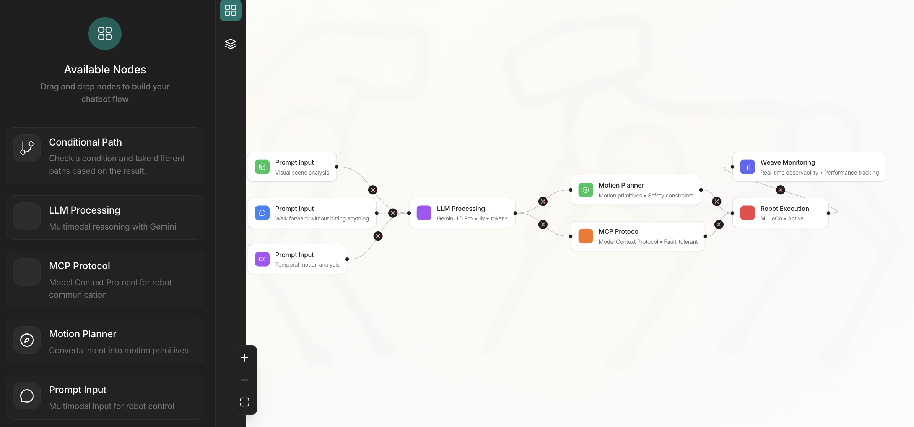

# RoboWeave: Prompt-Based Multimodal Control of Embodied Agents

**Daniel Siegel, Thomason Zhou**  
_Weave Hackathon 2025_

## Abstract

RoboWeave is a multimodal robot control pipeline that maps high-level prompts—expressed via natural language, images, or video—into structured robotic commands. It integrates the Google Gemini large multimodal model with model context protocol (MCP) servers to enable intuitive control of physical systems. The project features a comprehensive website with an interactive flow builder, demonstrating the integration of prompt engineering, multimodal reasoning, and real-time visualization capabilities.

## System Overview

The core objective of RoboWeave is to enable robotic actuation from semantically rich prompts. The system features a professional website with an interactive flow builder that allows users to visualize and customize the robot control pipeline. Input is collected via multimodal interfaces and Weave-integrated frontend that reads sensor input, routed to Gemini for interpretation, and ultimately converted into commands for backend motion planning and execution. The architecture supports text, image, audio, and video inputs and is designed to generalize across multiple robotic tasks.

## Website and Interactive Demo

The RoboWeave website provides a comprehensive interface for understanding and interacting with the robot control pipeline:


**Interactive Agent Flow Builder:**
- Professional drag-and-drop interface for building robot control flows
- Custom node types for each pipeline component
- Real-time connection validation and auto-adjustment
- Sidebar with available nodes for easy workflow construction
- Seamless visual integration with homepage design
- Based on elegant flow builder patterns with RoboWeave-specific customization


*Interactive flow builder interface showing the complete RoboWeave pipeline with custom nodes for prompt input, LLM processing, motion planning, MCP protocol, robot execution, and Weave monitoring.*

## Architecture

**Pipeline Components:**

1. **Prompt Input Nodes**
   - Text Input: Natural language commands with example prompts
   - Image Input: Visual scene analysis for spatial understanding
   - Video Input: Temporal motion analysis and demonstration learning
   - Each input type has distinct visual styling and validation

2. **LLM Processing Node**
   - Gemini 1.5 Pro with 1M+ token context window
   - Multimodal reasoning combining text, image, and video analysis
   - Structured output generation for motion planning
   - Real-time processing with fault tolerance

3. **Motion Planner Node**
   - Converts semantic intent into discrete motion primitives
   - Safety constraint validation and feasibility checking
   - State-aware planning with collision avoidance
   - Bezier curve-based smooth motion generation

4. **MCP Protocol Node**
   - Model Context Protocol for fault-tolerant communication
   - Structured command translation and validation
   - Real-time status monitoring and error handling
   - Protocol-compliant message formatting

5. **Robot Execution Node**
   - Physical robot actuation with MuJoCo integration
   - Real-time safety monitoring and validation
   - Execution feedback and status reporting
   - Emergency stop and recovery mechanisms

6. **Weave Monitoring Node**
   - Real-time observability and performance tracking
   - LLM call tracing and response analysis
   - Performance metrics and evaluation capabilities
   - Debug visualization and system insights

## Algorithm Details

**Motion Primitive Generation:**
- Bezier curve-based motion planning with control points
- Variable duration and velocity parameterization
- Primary and speculative path generation for robust execution
- Real-time collision detection and avoidance

**AI Decision Making:**
- Gemini 1.5 Pro processes multimodal inputs with structured prompting
- JSON output format with motion primitives and reasoning
- Consecutive failure handling with automatic fallback mechanisms
- Context-aware state tracking for improved decision quality

**Safety and Validation:**
- Multi-layer validation: prompt interpretation, motion planning, execution
- Real-time boundary detection and obstacle avoidance
- Emergency stop mechanisms and recovery procedures
- Execution monitoring with performance metrics

## Key Features

**Multimodal Interface:**
- Text prompts with natural language processing
- Image analysis for spatial understanding and object detection
- Video processing for temporal motion sequences and demonstrations
- Unified interface handling all input modalities

**Advanced AI Integration:**
- Gemini 1.5 Pro with maximum context window support
- Structured JSON output with Pydantic validation
- Real-time reasoning with sub-2-second response times
- Robust error handling and recovery mechanisms

**Professional User Experience:**
- Interactive flow builder with drag-and-drop functionality
- Real-time visualization of pipeline components
- Custom node types with detailed property panels
- Responsive design with mobile compatibility

**Observability and Monitoring:**
- Complete LLM call tracing with Weights & Biases Weave
- Performance metrics and evaluation dashboards
- Debug capabilities and system insights
- Real-time status monitoring and alerts

## Use Case Scenarios

Three representative success cases implemented and validated:

1. **Forward Navigation Without Collision**
   - Prompt: "Walk forward without hitting anything"
   - Visual scene analysis with obstacle detection
   - Collision-free path planning with safety constraints
   - Real-time execution monitoring

2. **Orientation Change**
   - Prompt: "Turn left 45 degrees"
   - Precise angular motion calculation
   - Controlled rotation with orientation verification
   - Pose validation through simulation telemetry

3. **Complex Task Execution**
   - Prompt: "Stand up and initiate handshake"
   - Multi-step task decomposition
   - Sequential motion primitive coordination
   - Task completion status monitoring

## Project Structure

```
roboweave/
├── frontend/
│   ├── website/                    # Main website application
│   │   ├── src/
│   │   │   ├── components/
│   │   │   │   ├── navigation/     # Navigation components
│   │   │   │   ├── sections/       # Homepage sections
│   │   │   │   └── demo/          # Demo components
│   │   │   ├── modules/
│   │   │   │   ├── flow-builder/   # Interactive flow builder
│   │   │   │   ├── nodes/          # Custom node types
│   │   │   │   └── sidebar/        # Sidebar interface
│   │   │   ├── pages/             # Route pages
│   │   │   └── stores/            # State management
│   │   ├── public/                # Static assets (logos, backgrounds)
│   │   ├── package.json
│   │   └── tsconfig.json
│   ├── capture_demo/              # Live API client and verification
│   ├── live_console/              # Console interface
│   ├── wasd_stream.py            # Game widget with navigation
│   └── requirements.txt
├── backend/
│   ├── assets/                    # 3D models and robot assets
│   ├── llm/                      # Gemini interaction and prompt-to-motion translation
│   ├── mcp/                      # MCP integration layer
│   ├── go2.mjcf                  # MuJoCo model definition
│   ├── scene_terrain.xml         # Simulation environment
│   └── test.ipynb               # Development notebooks
├── scripts/                       # Utilities and test cases
├── docs/                         # Documentation and presentations
└── README.md
```

## Technical Stack

**Frontend:**
- React 18 with TypeScript
- TanStack Router for navigation
- React Flow (@xyflow/react) for flow builder
- UnoCSS for styling with Claude-inspired design
- Zustand for state management

**Backend:**
- Python 3.10+ with asyncio support
- Google Gemini 1.5 Pro API integration
- MuJoCo for physics simulation
- Model Context Protocol (MCP) implementation
- PySide6 for game widget interface

**Development Tools:**
- Vite for build tooling
- ESLint and Prettier for code quality
- TypeScript for type safety
- Weights & Biases Weave for observability

**Design System:**
- Claude-inspired typography with Inter font
- Warm beige and amber color palette
- Glassmorphism effects with backdrop blur
- Responsive design with mobile optimization

## Dependencies

**Core Requirements:**
- Google Gemini API access
- Node.js 18+ and npm/yarn
- Python 3.10+ with pip
- Modern web browser with ES2020 support

**Python Dependencies:**
- google-genai for Gemini integration
- weave for observability and tracking
- PySide6 for UI components
- pydantic for data validation
- python-dotenv for environment management

**JavaScript Dependencies:**
- @xyflow/react for flow building
- @tanstack/react-router for routing
- zustand for state management
- @unocss/vite for styling

## Live Demo

The RoboWeave interactive flow builder is available at `/demo` and provides a comprehensive visualization of the robot control pipeline:


**Key Features Demonstrated:**
- Six custom node types representing the complete pipeline
- Drag-and-drop interface with professional styling
- Real-time connection validation between components
- Sidebar with available nodes for easy workflow construction
- Seamless integration with the main website design

## Installation and Setup

1. **Clone Repository:**
   ```bash
   git clone https://github.com/thomasonzhou/roboweave.git
   cd roboweave
   ```

2. **Setup Environment:**
   ```bash
   # Create .env file in frontend directory
   echo "GEMINI_API_KEY=your_api_key_here" > frontend/.env
   ```

3. **Install Frontend Dependencies:**
   ```bash
   cd frontend/website
   npm install
   npm run dev
   ```

4. **Install Python Dependencies:**
   ```bash
   cd frontend
   pip install -r requirements.txt
   ```

5. **Run Game Widget:**
   ```bash
   cd frontend
   python wasd_stream.py
   ```

## Deliverables (Weave Hackathon 2025)

- Complete website with interactive flow builder demonstrating robot control pipeline
- Professional user interface with drag-and-drop workflow construction
- End-to-end integration from multimodal prompts to robot execution
- Real-time observability with Weights & Biases Weave tracking
- Comprehensive documentation and source code
- Live demonstration of three validated use cases

## Team

**Daniel Siegel** - Hardware & Systems Engineering  
Website: [siegel.bio](https://siegel.bio)  
Email: danieledisonsiegel@gmail.com  
Focus: Embedded robotics platforms, low-level control systems, real-time firmware, hardware-software integration

**Thomason Zhou** - Robotics & Systems Engineering  
Website: [thzhou.com](https://thzhou.com)  
Email: contact@thzhou.com  
Focus: Robotic mobility and HRI, ROS2 control stacks, state-estimation for exoskeletons, MCP-integrated perception pipelines

Developed for the 2025 Weave Hackathon showcasing integration of advanced AI systems with robotic control platforms.
